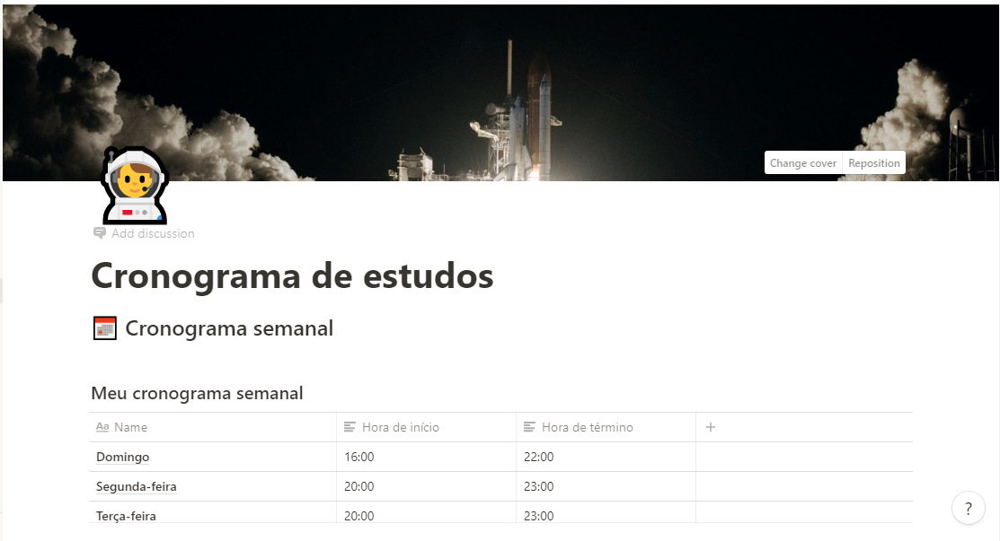

<h1 align="center">
	Cronograma GoStack
</h1>

Meu cronograma para BootCamp GoStack

  

  

  

  

## 🚀 Projeto

O objetivo é desenvolver um cronograma dos meus estudos do BootCamp GoStack.

## 🚧 **Em Desenvolvimento...**

---

Feito com ♥ by [Igor Thierry](https://www.linkedin.com/in/igor-thierry-bastos-de-pina-204a27a6/)

